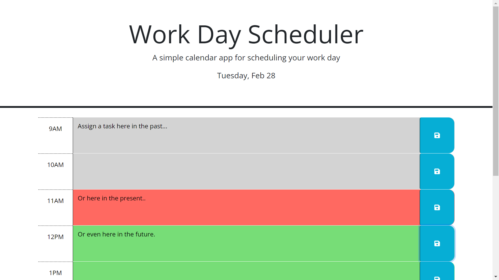

# Word Day Scheduler

## Description
This is a simple scheduler that allows a user to assign tasks/notes to specific time blocks and reference them later.  

At the top of the page is displayed the application title, a simple application description, and the date when the page was most recently loaded/reloaded.
It assumes a typical 9am-5pm work day.  Each hour of the work day has a unique time block.  The time blocks will have differing background colors to indicate whether they are past (grey), present (red), or future (green) in relation to the current hour.

## Appearance

## Functionality
The user can navigate to the time block in which they want to add a task.  Mouse click within the text area of the desired time block and type text into the field.  Mouse over to the save button on the right edge of the associated time block.  The save button icon will transition from white to black to indicate the mouse is hovering over the button.  Click the button and the task will be committed to local storage.

When the page is reloaded/refreshed, the user will see that the date in the header is updated and assigned tasks are visible within their respective time blocks.  Aswell, the background colors will update to indicate changes consisent with the time of the reload.  

To delete a task the user may click on the desired text and keyboard delete.  Follow that with a click of the save button and the tasks will be updated.

## Programming Tool
* HTML
* CSS
* JavaScript
* Bootstrap
* Fontawesome
* Google Fonts
* jQuery
* Day.js

## Deployed Link
https://paul-runge.github.io/work-day-scheduler/